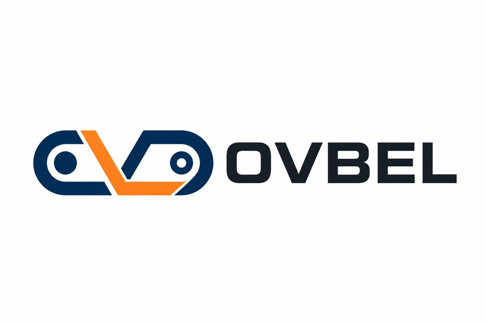

# OVBEL 工业机械配件网站开发实施方案

> 网站域名：<https://ovbel.com>  
> 网站品牌：OVBEL  
> 公司资料来源：<https://www.respowerbelt.com/>  
> 视觉参考：<https://hr31395247.jzfkw.net/>  
> 技术方向：GitHub + Next.js + Headless CMS + Cloudflare Workers

## 1. 项目定义

### 1.1 网站主体

OVBEL 定位为面向海外市场的 B2B 工业机械配件网站，核心业务覆盖：

- 工业输送带
- 动力传动带
- 输送系统组件
- 工业橡胶制品与胶管
- 破碎机和矿山机械配件
- 电机与驱动设备

网站不是面向个人消费者的零售商城，第一阶段以产品展示、技术信息、询盘转化和公司能力展示为核心。

### 1.2 品牌与公司关系

- 网站品牌：OVBEL
- 网站域名：ovbel.com
- 公司主体：Shandong Ovbel Industrial Co., Ltd
- 公司所在地：Linyi, Shandong Province, China

页面使用方式：

- 页眉、产品和营销内容统一使用 OVBEL。
- About Us 和页脚法律信息显示公司主体全称。
- 可使用 `OVBEL is operated by Shandong Ovbel Industrial Co., Ltd.` 说明品牌与公司的关系。

### 1.3 公司介绍基础事实

根据现有网站，公司信息按以下内容整理：

- 公司位于中国山东省临沂市。
- 业务覆盖设计、制造、营销、安装和调试。
- 拥有生产线、检测和控制实验室。
- 拥有研发、生产、销售和服务团队。
- 公司理念为 Quality First。
- 提供 OEM 和 ODM 服务。
- 服务对象包括终端客户、贸易商、批发商和进口商。
- 现有网站声明业务覆盖 140 多个国家和地区。

上述信息将重新编写为专业英文，不直接复制原站存在语法问题的句子。

## 2. 品牌视觉方案

### 2.1 Logo 初稿

Logo 文件：`ovbel-logo-concept-v1.png`



设计含义：

- 图形融合字母 O 和 V。
- 外轮廓表现连续运行的输送带或动力传动回路。
- 两个圆点可联想到滚筒、轴承和驱动轮。
- 深蓝传达可靠、工程和工业属性。
- 橙色表达动力、效率和安全提示。
- 字标采用粗壮、易识别的工业无衬线风格。

正式开发前需要基于初稿制作：

- 横版标准 Logo
- 仅图形标志
- 深色背景反白版
- 透明背景 PNG
- SVG 矢量版
- Favicon 和社交头像版本

### 2.2 建议色彩

参考站的主要结构采用深灰、白色和工业蓝；新站沿用这种工业感，并加入 Logo 的橙色作为行动色。

| 用途 | 色值 | 说明 |
|---|---|---|
| Primary Navy | `#0B3A6E` | Logo、标题、导航重点 |
| Reference Blue | `#1E50AE` | 链接、标签、信息模块 |
| Safety Orange | `#FF7A00` | 询价按钮和重点数据 |
| Charcoal | `#222222` | 顶部信息栏和页脚 |
| Text | `#333333` | 正文 |
| Light Gray | `#F4F6F8` | 模块背景 |
| White | `#FFFFFF` | 页眉、卡片和留白 |

### 2.3 字体

- 英文标题：Inter / Manrope，600～700 字重。
- 英文正文：Inter，400～500 字重。
- 中文：Noto Sans SC。
- 技术参数和型号可使用等宽数字样式，提高表格可读性。

## 3. 视觉参考站的转化方式

参考站的视觉特点：

- 深色顶部信息栏。
- 白色主导航。
- 大幅工业机械首屏图片。
- 蓝色作为主要强调色。
- 首页以产品分类、公司介绍、专业能力、应用领域和联系模块向下展开。
- 白色内容区与深色页脚形成明显对比。

OVBEL 将参考其页面节奏，但进行以下提升：

- 不复制原站 Logo、图片、模板文案或页面代码。
- 使用 OVBEL 深蓝和橙色品牌系统。
- 产品区改成真实的六大分类卡片。
- 首页首屏突出产品查找和 Request a Quote。
- 加入规格表、应用行业、相关产品和结构化询盘。
- 移动端导航采用两级折叠菜单，避免产品项全部堆叠。
- 增加更清晰的留白、网格和响应式产品卡片。

## 4. 产品分类与第一批产品

六个产品分类全部保留。第一阶段每个分类实现两个产品，共 12 个产品页。

### 4.1 Conveyor Belts

#### Chevron Conveyor Belt

现有资料可用内容：

- 用于粉状、颗粒状和块状物料的倾斜输送。
- 适用倾角资料标注为 0～40°。
- 带芯可选 CC、CP、NN、EP。
- 现有资料宽度为 300～800 mm。
- 花纹高度为 5、10、15、20 mm。
- 花纹包含人字、8 字、鱼骨、U 型、圆柱和麻面等。
- 支持按客户要求设计花纹。

#### Rough Top Conveyor Belt

现有资料可用内容：

- 2 层或 3 层 EP 织物结构。
- 防滑表面可以缓冲振动和冲击。
- 可选底覆盖层或裸背。
- 用于袋、箱和包裹等轻型货物倾斜输送。
- 现有资料标注最大倾角约 35°，需在发布前核对。

### 4.2 Power Transmission Belts

#### Transmission Flat Belt

现有资料可用内容：

- 以棉帆布作为骨架层的平型橡胶传动带。
- 用于工厂、矿山、码头、冶金、粮食加工和动力传输设备。
- 规格包括 28、30、32、34、36 OZ。
- 可选 Cut Edge 和 Round Edge。

#### V-Belt

现有网站已设置该产品类型，但公开技术内容不足。第一阶段可使用现有产品图片和名称建立页面，以下资料需要补充：

- 型号系列
- 顶宽、高度和长度
- 芯线材料
- 包布或切边结构
- 工作温度
- 适用设备

### 4.3 Conveyor Components

#### Impact Bed / Impact Bar

现有资料可用内容：

- 由橡胶、钢或铝框架和 UHMWPE 组成。
- 用于装料点和转运点吸收冲击。
- 具有低摩擦、耐磨、减少飞溅和保护皮带等特点。
- 无移动部件，不需要润滑。

#### Elevator Buckets

现有资料可用内容：

- 超过 12 种型号和约 400 个尺寸。
- 材料包括 HDPE、Nylon 和 PU。
- 支持不同安装孔定制。
- 覆盖农业和工业提升应用。
- DM、EU、AA 等类型的尺寸和间距信息需以原始尺寸表为准。

### 4.4 Rubber Products & Hoses

#### Rubber Sheet

现有资料可用内容：

- 通用工业和技术应用。
- 黑色标准片材。
- 可按客户尺寸定制。
- 现有资料标注厚度范围 1～100 mm。

需要补充橡胶类型、硬度、密度、耐温和耐介质信息。

#### Hydraulic Hose

现有网站已设置该产品类型，但公开技术内容不足。需要补充：

- 内径和外径
- 钢丝或纤维增强层
- 工作压力和爆破压力
- 温度范围
- 适用介质
- 接头和标准

### 4.5 Crusher & Mining Parts

#### Hammer for Crusher

现有网站已设置该产品类型。第一阶段需要从原站迁移图片，并补充：

- 适用破碎机类型
- 材料和热处理
- 硬度
- 尺寸、重量和图纸编号
- 设备型号或 OEM 号

#### Mine Screen Mesh

现有网站已设置该产品类型。需要补充：

- 丝径
- 孔径和开孔率
- 材料
- 网片尺寸
- 边缘和固定方式
- 适用筛分物料

### 4.6 Motors & Drive Equipment

#### Electric Motor

现有网站已设置该产品类型。需要补充：

- 功率
- 电压和频率
- 转速和极数
- 防护等级
- 绝缘等级
- 安装方式
- 能效标准

#### Bearing

现有网站将 Bearing 放在破碎机配件中；新站把它作为驱动与旋转部件展示，并同时关联 Crusher & Mining 应用。需要补充：

- 轴承类型
- 内径、外径和宽度
- 精度等级
- 密封形式
- 载荷和转速
- 品牌、替代号和应用设备

## 5. 第一阶段页面清单

### 公共页面

1. Home
2. Products
3. 六个产品分类页
4. 12 个产品详情页
5. Industries
6. About Us
7. OEM & Custom Service
8. Quality Control
9. Contact Us
10. Request a Quote
11. Privacy Policy
12. 404 页面

### 第一阶段行业页

- Mining & Quarry
- Material Handling & Logistics
- Manufacturing & Processing
- Food & Grain Processing

其余行业在 CMS 中预留，后续增加。

## 6. 首页结构

### 6.1 顶部信息栏

- 公司所在地
- 销售邮箱/电话/WhatsApp
- Request a Quote 快捷入口

### 6.2 主导航

- Logo
- Products
- Industries
- OEM Service
- Quality
- About
- Contact
- 搜索按钮
- 橙色 Get a Quote 按钮

### 6.3 Hero 首屏

建议英文主标题：

> Industrial Machinery Parts Built for Reliable Performance

建议副标题：

> Conveyor belts, power transmission products, conveyor components, rubber parts and mining spares supplied for demanding industrial applications.

按钮：

- Explore Products
- Request a Quote

### 6.4 六大产品分类

使用 3×2 卡片网格，展示分类图片、简介和进入按钮。

### 6.5 Featured Products

展示 8 个重点产品；后台可以控制推荐顺序。

### 6.6 Industry Solutions

首期展示矿山、物料输送、制造加工和粮食加工四个行业。

### 6.7 Why OVBEL

- Product Range
- OEM/ODM
- Quality Control
- Export Experience
- Technical Support

### 6.8 About OVBEL

使用公司、工厂或仓库图片，并链接到 About Us。

### 6.9 Inquiry CTA

强调客户可以提交型号、图纸、尺寸或现有零件照片获取报价。

### 6.10 Footer

- 公司主体信息
- 产品分类
- 主要行业
- 联系方式
- 隐私政策
- Copyright 自动年份

## 7. 产品详情页模板

每个产品页统一包含：

1. 面包屑导航。
2. 产品图片画廊。
3. 产品名称、SKU/系列、摘要。
4. Request a Quote 按钮。
5. Applications。
6. Features。
7. Technical Specifications。
8. Available Materials / Sizes / Variants。
9. Customization。
10. Packaging & Delivery。
11. PDF Datasheet。
12. Related Products。
13. 自动绑定产品信息的询盘表单。

没有真实参数的字段不显示，不使用虚构数值或 `TBD` 填充公开页面。

## 8. 内容与语言

- 第一阶段以前台英文为主。
- CMS 从一开始采用中英文字段，为后续中文站预留。
- 现有网站英文只作为事实来源，需要重新润色。
- 参数、标准和型号保持原单位，并提供必要的国际单位换算。
- 不能确认的产能、国家数量、认证和性能数据在上线前复核。

## 9. 技术实现

### 9.1 技术栈

- Frontend：Next.js + TypeScript
- Styling：Tailwind CSS
- CMS：Sanity
- Hosting：Cloudflare Workers + OpenNext
- Source Control：GitHub 私有仓库
- Media：第一阶段使用 CMS 媒体库，后续可迁移到 Cloudflare R2
- Form Protection：Cloudflare Turnstile
- Analytics：Cloudflare Web Analytics，可选接入 GA4

选择 Sanity 的原因：

- 业务人员可以直接维护产品。
- 支持结构化产品字段和多语言。
- 不需要在 Cloudflare 上自行维护 CMS 服务器。
- 产品发布后可以通过 Webhook 更新网站缓存。

### 9.2 部署流程

```text
开发功能分支
  ↓
GitHub Pull Request
  ↓
Cloudflare 预览部署
  ↓
确认页面和内容
  ↓
合并 main
  ↓
Cloudflare 正式部署到 ovbel.com
```

### 9.3 仓库建议

```text
ovbel-website/
├── src/
│   ├── app/
│   ├── components/
│   ├── lib/
│   └── styles/
├── public/
│   └── brand/
├── sanity/
│   └── schemas/
├── scripts/
│   └── product-import/
├── tests/
├── open-next.config.ts
└── wrangler.jsonc
```

## 10. CMS 模型

第一阶段建立：

- Product
- Product Category
- Industry
- Page
- Company Information
- Site Settings
- Inquiry

Product 至少包含：

- name、slug、SKU
- category、industries
- summary、description
- applications、features
- specifications
- variants
- standards
- images、PDF
- MOQ、packaging、lead time
- customization
- related products
- SEO title、SEO description
- draft/published/discontinued 状态

## 11. 内容迁移规则

从 `respowerbelt.com` 迁移：

- 公司事实和业务能力。
- 六大分类对应的现有产品名称。
- 第一批 12 个产品的可用描述和参数。
- 公司拥有版权的产品图、工厂图和应用图。

迁移时必须：

- 将 RESPOWER 营销品牌替换为 OVBEL。
- 在法律公司信息中使用 Shandong Ovbel Industrial Co., Ltd。
- 修复拼写、语法、重复正文和损坏表格。
- 不直接引用原站图片 URL，应取得原始文件后上传新 CMS。
- 不复制参考视觉站的图片、Logo、文案或代码。

## 12. 域名与上线

- 正式域名：ovbel.com。
- DNS 托管到 Cloudflare。
- 自动启用有效 HTTPS 证书。
- 建议同时配置 `www.ovbel.com` 并 301 跳转至主域名。
- 配置 `info@ovbel.com` 或 `sales@ovbel.com` 企业邮箱。
- 源站当前存在的证书问题不会迁移到新域名。
- 如果旧站需要保留流量，应单独配置旧 URL 到 OVBEL 新页面的跳转。

## 13. 实施阶段

### 阶段一：品牌与基础工程

- 确认 Logo 初稿。
- 完成 SVG、透明版和 Favicon。
- 创建 GitHub 仓库。
- 建立 Next.js 和 Cloudflare 预览环境。
- 建立颜色、字体和基础组件。

### 阶段二：CMS 与内容

- 建立六类产品模型。
- 创建 12 个首批产品。
- 迁移公司信息和图片。
- 建立 Excel 批量导入能力。

### 阶段三：页面开发

- 首页。
- 产品中心、分类和详情页。
- Industries、About、OEM、Quality、Contact。
- 搜索和询盘表单。

### 阶段四：上线验收

- 响应式测试。
- 内容和参数复核。
- SEO 与结构化数据。
- Turnstile、邮件和转化测试。
- Cloudflare 性能和缓存。
- 绑定 ovbel.com 并上线。

## 14. 第一阶段验收范围

- OVBEL 品牌系统正确应用。
- 六个产品分类全部上线。
- 每个分类至少两个产品，共 12 个产品页。
- 首页视觉节奏接近参考站，但内容和设计为原创实现。
- 产品可以在 CMS 中新增、编辑、预览和发布。
- 产品详情支持不同类型的参数字段。
- 网站可以按名称、分类和关键词查找产品。
- 询盘自动携带产品名称、SKU 和来源页面。
- GitHub 合并后自动部署到 Cloudflare。
- ovbel.com 和 HTTPS 正常。
- 手机、平板和电脑端正常显示。
- SEO、Sitemap、Canonical 和结构化数据正确。

## 15. 当前仍需补充的资料

开始开发不受影响，但正式上线前仍需提供：

- 公司正式地址和邮编
- 销售邮箱、电话、WhatsApp
- Logo 初稿确认意见
- 12 个产品的原始图片
- V-Belt、Hydraulic Hose、Crusher Hammer、Screen Mesh、Electric Motor、Bearing 的技术参数
- 工厂、仓库、质量检测和包装照片
- 可以公开展示的证书
- MOQ、包装和交货期规则

---

本方案已经按 OVBEL 工业机械配件站、六大产品分类、每类两个首发产品以及指定视觉参考重新整理。下一步可以直接进入 Logo 定稿和网站基础工程搭建。
